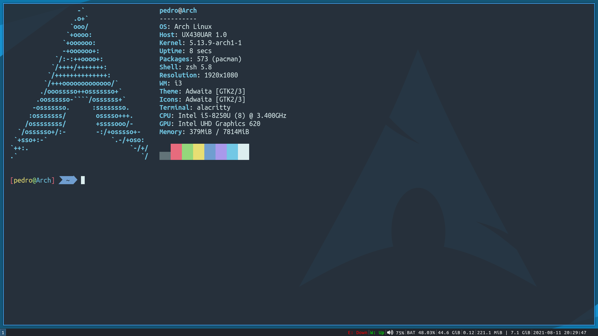

# dotfiles

- Window Manager: [i3](https://github.com/i3/i3)
- Status Bar: [i3status](https://github.com/i3/i3status)
- Display Manager: [LightDM](https://github.com/canonical/lightdm)
- Audio Server: [PulseAudio](https://www.freedesktop.org/wiki/Software/PulseAudio)
- Screen Locker: [i3lock-fancy](https://github.com/meskarune/i3lock-fancy)
- Compositor: [picom](https://github.com/yshui/picom)
- Program Launcher: [dmenu](https://tools.suckless.org/dmenu)
- File Manager: [thunar](https://gitlab.xfce.org/xfce/thunar)
- Terminal Emulator: [alacritty](https://github.com/alacritty/alacritty)
- Editor: [vim](https://github.com/vim/vim)
- Font: [Ubuntu Mono](https://design.ubuntu.com/font)
- Color Scheme: [Monokai Pro](https://monokai.pro)
- Theme: [Arc-Dark](https://github.com/horst3180/arc-theme)
- Icon Theme: [Papirus-Dark](https://github.com/PapirusDevelopmentTeam/papirus-icon-theme)
- Cursor Theme: [Breeze Obsidian](https://aur.archlinux.org/packages/breeze-obsidian-cursor-theme)

## Screenshot

