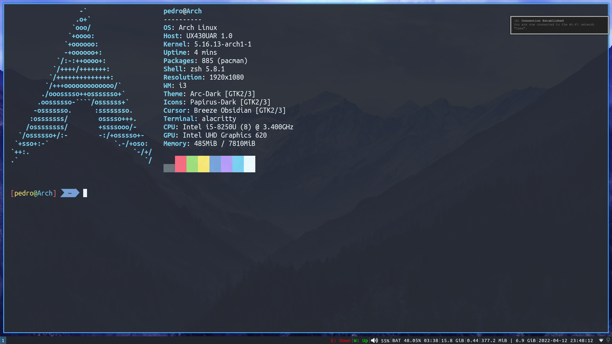

# dotfiles

- Window Manager: [i3](https://github.com/i3/i3)
- Status Bar: [i3status](https://i3wm.org/i3status)
- Program Launcher: [dmenu](https://tools.suckless.org/dmenu)
- Terminal Emulator: [alacritty](https://github.com/alacritty/alacritty)
- Editor: [vim](https://github.com/vim/vim)
- Font: [Ubuntu Mono](https://design.ubuntu.com/font)
- Color Scheme: [Monokai Pro](https://monokai.pro)

## Screenshot

